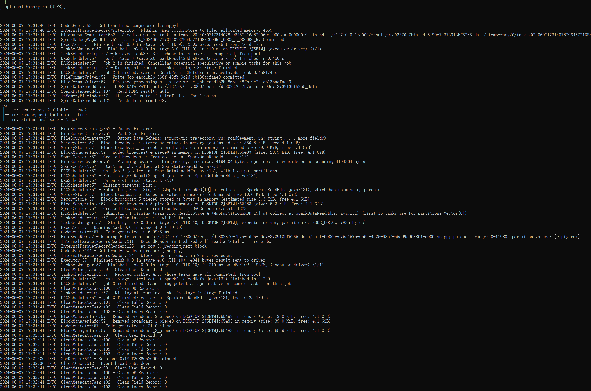
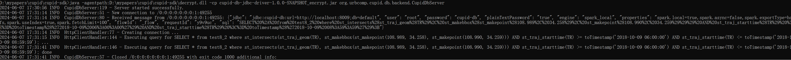
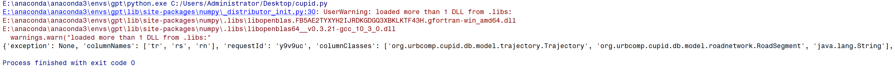

# Cupid-SDK
This is a demo SDK of Cupid, which runs on a single machine. We are working on releasing distributed versions of Cupid SDK.

Download the cupid-db_encrypt.jar and cupid-db-jdbc-driver-1.0.0-SNAPSHOT_encrypt.jar from [Google Drive](https://drive.google.com/drive/folders/1gc0lZBMEzODX3CcVxF3aSob9iF0FRSb8?usp=drive_link). The former one is the main engine of Cupid and the latter one leverages WebSocket to deal with queries.

We also provide libraries for decrypting the jars, i.e., ```decrypt.dll``` for Windows and ```libdecrypt_cupid.so``` for Linux.

To run the SDK, you need to install JDK (version 1.8.0_191), MySQL (version >= 5.7), Hadoop (version 3.2.1) and HBase (version 2.2.7).

After installing Hadoop, you need to run ```hadoop fs -chmod 777 /``` to ensure that Cupid can write to HDFS.

After installing MySQL, create a user ```cupid_db``` with password ```cupid_id```:
```sql
CREATE USER 'cupid_db'@'localhost' IDENTIFIED BY 'cupid_db';
GRANT ALL ON *.* TO 'cupid_db'@'%' IDENTIFIED BY 'cupid_db';
FLUSH PRIVILEGES;
```
and make MySQL [accept all remote connections](https://serverfault.com/questions/586651/mysql-refuses-to-accept-remote-connections). Then, run ```ddl.sql``` to insert all necessary tables and data into MySQL.

Put cupid.conf into the HDFS path ```hdfs://opt/spark-apps```.

We also provide modified Geomesa coprocessors and our proposed indices in [Google Drive](https://drive.google.com/drive/folders/14L3R2jQ9tHBQna1u4IEKM1gYSFvzJ_UF?usp=drive_link). To speed up the queries, you should put all these jars into the ```lib``` directory inside HBase installation. For Windows, change the line ```set java_arguments=%HEAP_SETTINGS% %HBASE_OPTS% -classpath "%CLASSPATH%" %CLASS% %hbase-command-arguments%``` in the file ```bin/hbase.cmd``` to ```set java_arguments=%HEAP_SETTINGS% %HBASE_OPTS% -agentpath:D:\mypapers\cupid\cupid-sdk\decrypt.dll -classpath "%CLASSPATH%" %CLASS% %hbase-command-arguments%``` (change the absolute path correspondingly). For Linux, change the line in the file ```bin/hbase``` to ```"$JAVA" -Dproc_$COMMAND -XX:OnOutOfMemoryError="kill -9 %p" $HEAP_SETTINGS $HBASE_OPTS -agentpath:/usr/local/libdecrypt_cupid.so $CLASS "$@"``` (change the absolute path correspondingly).

Finally, run ```java -agentpath:decrypt.dll -jar cupid-db_encrypt.jar org.urbcomp.cupid.db.server.CupidDbServerStart``` to start the Cupid backend server, and then run ```java -agentpath:decrypt.dll -cp cupid-db-jdbc-driver-1.0.0-SNAPSHOT_encrypt.jar org.urbcomp.cupid.db.backend.CupidDbServer``` to start the Cupid WebSocket wrapper. (For Linux, change the agentpath argument to be ```libdecrypt_cupid.so```)

If the installation is correct, you will see examples of Cupid running properly, as shown in the following  figures.





You can use the provided ```cupid.py``` to connect to Cupid and run queries. Some example queries are also provided in the Python script.
